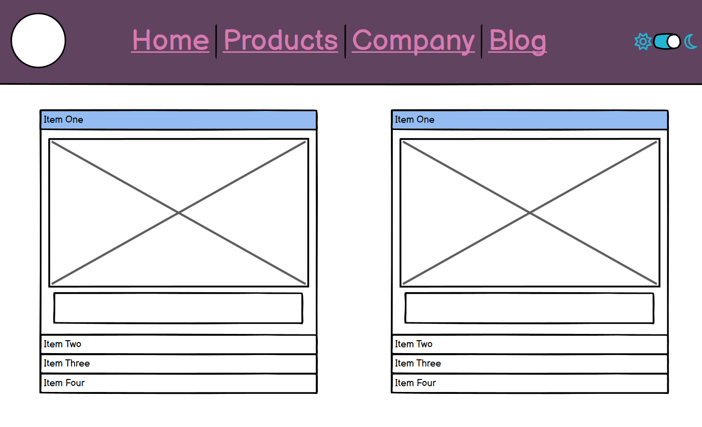

README.md
# bootcamp-diversity-project
(Code Institute) HTML/CSS/Bootstrap Individual Project - Diversity and Inclusion

## INTRODUCTION

My submission for my first individual project is [Name of Website], a website that uses HTML, CSS and Bootstrap
to provide basic information about the LGBTQ+ community and their rights within workplace and educational environments, intended to educate and
inform people who may know little about the subject.

The live version of this project can be found <a href="https://abrawalker.github.io/bootcamp-dei-project/" target="blank">here.</a>

Our brief/criteria for this project was:

- Create a website about diversity and inclusion. The user wants to gain a basic understanding of diversity and inclusion in the workplace or educational environment. 
They seek straightforward information and tips presented in a clear, organised format.

- The site owner aims to create a visually appealing, easy-to-navigate webpage that introduces diversity and inclusion concepts and offers basic guidance on how to implement these practices. 
The focus is on clear communication through effective use of HTML and CSS, utilising Bootstrap for layout and design.

## CONTENTS
* [LGBT ABCs](#bootcamp-diversity-project)
- [Introduction](#INTRODUCTION)
- [Contents](#CONTENTS)
- [User Stories](#USER-STORIES)
- [Design](#DESIGN)
- [Colours](#COLOURS)
- [Fonts](#FONTS)
- [Images](#IMAGES)
- [Wireframes](#WIREFRAMES)
- [Features](#FEATURES)
- [Tech](#TECH)
- [Testing](#TESTING)
- [Sources and References](#SOURCE)

## USER STORIES
User stories are further explored in the project's dedicated board.

- As a visitor, I want the webpage to be easy to navigate, so I can look up specific information about the topics I’m interested in.
- As a person unfamiliar with the community, I want a basic introduction to keywords and phrases used to describe LGBTQ+ people.
- As an LGBTQ+ person, I want access to resources and further information to learn my rights as an LGBTQ+ person at work/school.
- As an educator, I want information provided in a formal, clear way with language and concepts that are accessible to people of all ages.
- As a person who works in HR, I want a clear list of guidelines and practices to make an environment comfortable for LGBTQ+ staff.
- As an ally, I want resources with information to support LGBTQ+ people and learn more about LGBTQ+ rights.
- As a user, I want to be able to access this site on any device, so I can share it to other interested users.

## DESIGN
## COLOURS

Shown above is my selected colour scheme, as displayed on Coolors.
I used a blue and pink colour scheme, as it was a colour scheme relevant to the content.

If I had more time with my project, I would implement these colours as a darker option for the site's design.

## FONTS

[Cherry Bomb One](https://fonts.google.com/specimen/Cherry+Bomb+One?lang=ja_Hira) for headings.
[Nunito Sans](https://fonts.google.com/specimen/Nunito+Sans?categoryFilters=Sans+Serif:%2FSans%2FRounded) for the body,

## IMAGES

All images and icons were sourced from Pexels and Iconify.

Sexuality Photo by Rosemary Ketchum  
Gender Photo by RDNE Stock Project  
Pride-One by Rosemary Ketchum  
Pride-Two by Rosemary Ketchum  
Pride-Three by RDNE Stock Project  
Pride-Four by Eduardo González  
Pride-Five by Elvis Yang  
flower-pride by Antonio Herrera Palacios  
header by Gotta Be Worth It  
pride-uk by Peter Muscutt  
lgbt-work  by Ivan Samkov  
lgbt-school by Anastasiya Badun  

## WIREFRAMES

I made many changes to the design of the website as developement went on. Specific features will be discussed in the <a href="#FEATURES">features</a> section.

## FEATURES

### Navigation and Hero

I added a navigation bar to the top of the page as I knew I wanted to make a one-page website, and quick access to the sections would make
the site easier to use for people who want specific information.

The navigation bar I used is a Bootstrap component with a dropdown menu for the DEI section.

### Dictionary

I used Bootstrap's accordion element to create a dictionary for users who might be unfamiliar with certain terminology used to refer to the
LGBT community. Accordions are a good way to display information per user request; users have to select a specific element that they want to view and irrelevant
text is hidden. By doing this, the user is not overwhelmed with a wall of text that might not be relevant to what they are looking for.

To make my dictionary eye-catching, I styled them to change colour when an element is clicked on.

### Cards

Bootstrap cards were also used in my website to highlight key points about DEI in the UK, add some images to the site, and provide further information.

### Carousel

The small photo gallery towards the end was created using Bootstrap carousel. I decided to use the autoplaying style of carousel, as the photos don't contain
information or anything to be read, so the user shouldn't need to scroll through the gallery themselves. However, there are arrows bordering the carousel, enabling
the user to scroll through the gallery at their own pace too.

### Leave Button

Inspired by the LGBT Foundation website, I added a "leave this page" button to the site. This is to provide a serivce to people who may need to hide their use of
the site quicker than minimising the screen or clicking a new tab. Though it is not techinically very interesting, I felt it was a necessary inclusion.

### Links to Phone Numbers

I had a similar thought process when adding telephone number links. For people browsing on their phones who may need immediate advice or support, I added 
telephone links that forward to a device's call functionality.

## TECH

Languages: HTML and CSS  
Libraries: Bootstrap 5  
Version Control: Git and GitHub  
Wireframe: Balsamiq  
AI (Debugging): Microsoft CoPilot  

## TESTING

Python 3.9 for site previews during development.  
<a href="https://validator.w3.org/" target="_blank">HTML Validation</a>
<a href="https://jigsaw.w3.org/css-validator/" target="_blank">CSS Validation</a> 

## SOURCES AND REFERENCES

Dictionary definitions provided by <a href="https://www.stonewall.org.uk/resources/list-lgbtq-terms" target="_blank">Stonewall UK.</a>  
DEI information sourced from <a href="https://www.stonewall.org.uk/get-involved/campaign-with-us/dont-repeat-history-protect-lgbtq-inclusive-education/lgbtq-inclusive-education-everything-you-need-know" target="_blank">Stonewall UK</a>,  
<a href="https://www.cipd.org/uk/knowledge/reports/inclusion-perspectives-lgbt/" target="_blank">CIPD</a> and <a href="https://labourlaws.co.uk/employment-law-and-lgbtq-rights/" target="_blank">Labour Laws.</a> 
All images sourced from <a href="https://www.pexels.com/" target="_blank">Pexels.</a>  
All icons sourced from <a href="https://icon-sets.iconify.design/" target="_blank">Iconify.</a>  
Features sourced from <a href="https://getbootstrap.com/docs/5.3/getting-started/introduction/" target="_blank">Bootstrap 5 documentation.</a>  